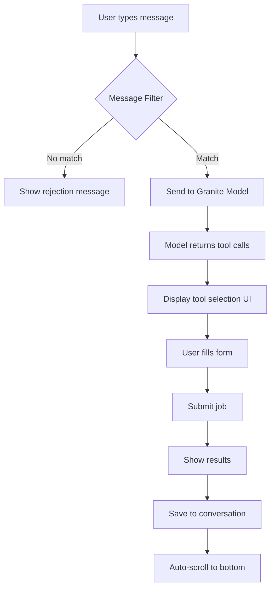
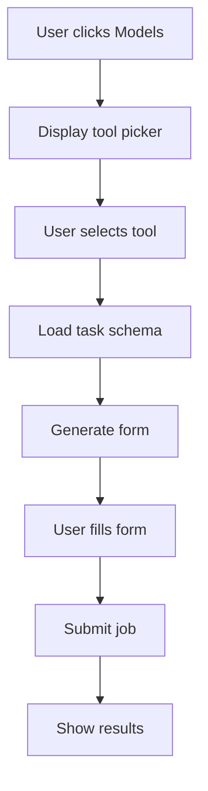
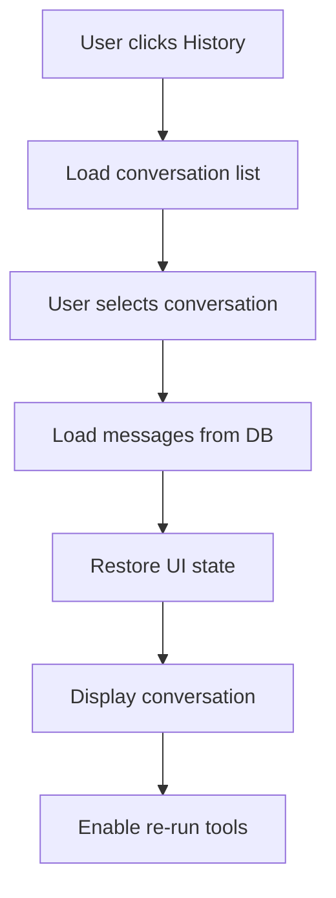

# RescueBox Frontend UI Workflows

**Version:** 1.0.0
**Date:** 2025-01-07
**Framework:** NiceGUI (Python Web UI)

## Table of Contents

1. [Overview](#overview)
2. [Chat Workflow (/analyze)](#chat-workflow-analyze)
3. [Models Workflow (Tool Picker)](#models-workflow-tool-picker)
4. [Load Conversation Workflow (History)](#load-conversation-workflow-history)
5. [Common UI Patterns](#common-ui-patterns)
6. [State Management](#state-management)
7. [Error Handling](#error-handling)

---

## Overview

The RescueBox frontend implements three major UI workflows that handle different user interaction patterns. Each workflow is designed to provide a seamless experience while maintaining robust error handling and state management.

### Architecture Overview

```
User Interaction → Route Handler → Workflow Coordinator → UI Components
                        ↓
               State Management ←→ Error Handling
                        ↓
               API Calls → Result Processing → UI Updates
```

---

## Chat Workflow (/analyze)

The chat workflow handles natural language interactions where users can describe what they want to accomplish, and the system automatically selects and executes appropriate tools.

### Flow Diagram



### Key Components

#### 1. Message Processing (`frontend/pages/chatbot/handlers/message_processor.py`)

**Purpose:** Processes user messages and coordinates the analysis workflow.

**Key Functions:**
- `handle_send_message()`: Main entry point for message processing
- `process_user_message()`: Routes messages to appropriate handlers
- `handle_smart_analyze()`: Handles tool selection via AI model

**Code Flow:**
```python
async def handle_send_message(message: str, container, input_field, status_label, state_manager):
    # 1. Validate and preprocess message
    # 2. Route to appropriate handler (smart_analyze vs direct tool)
    # 3. Process results and update UI
    # 4. Handle scrolling and focus management
```

#### 2. Form Submission (`frontend/pages/chatbot/handlers/form_submit_handler.py`)

**Purpose:** Handles form validation, job submission, and result processing.

**Key Functions:**
- `submit_form()`: Orchestrates complete form submission workflow
- `validate_request()`: Validates form data against task schema
- `handle_job_response()`: Processes API responses and updates UI

**Code Flow:**
```python
async def submit_form(request_body, endpoint, task_schema, container, core, state_manager):
    # 1. Validate request data
    # 2. Create conversation if needed
    # 3. Submit job to backend
    # 4. Process response and save to history
    # 5. Display results in UI
```

#### 3. UI Components (`frontend/pages/chatbot/chatbot_ui.py`)

**Purpose:** Manages the chat interface layout and user interactions.

**Key Functions:**
- `create_chat_ui()`: Builds complete chat interface
- `handle_mode_switching()`: Manages different UI modes (chat, models, history)
- `setup_input_handling()`: Configures keyboard and button handlers

### State Transitions

| State | Trigger | Next State | UI Changes |
|-------|---------|------------|------------|
| **Idle** | User types message | Processing | Show spinner, disable input |
| **Processing** | Message sent to model | Tool Selection | Display tool picker UI |
| **Form Display** | Tool selected | Form Filling | Show form with pre-filled data |
| **Job Running** | Form submitted | Results Display | Show job status, results |
| **Complete** | Job finished | Ready | Enable input, show results |

### Error Handling

- **Network Errors:** Display retry options, log detailed error information
- **Validation Errors:** Highlight invalid fields, show helpful error messages
- **Job Failures:** Display error details, allow re-submission with modified parameters

---

## Models Workflow (Tool Picker)

The models workflow allows users to browse available tools and manually select which ones to use, bypassing the AI-driven tool selection.

### Flow Diagram



### Key Components

#### 1. Tool Picker (`frontend/pages/chatbot/pickers.py`)

**Purpose:** Provides UI for browsing and selecting available tools.

**Key Classes:**
- `ToolPicker`: Displays tools in a grid layout with descriptions
- `AnalysisPicker`: Specialized picker for analysis tools
- `BasePicker`: Common functionality for all pickers

**Code Example:**
```python
class ToolPicker(BasePicker):
    def __init__(self, on_tool_selected):
        super().__init__(on_tool_selected)
        self.tools = []  # Loaded from API

    def render(self):
        # Create grid of tool cards
        # Each card shows: icon, name, description, tags
        # Clicking card triggers on_tool_selected callback
```

#### 2. Form Generation (`frontend/components/forms/form_generator.py`)

**Purpose:** Dynamically generates forms based on task schemas.

**Key Features:**
- **Dynamic Field Types:** Supports text, file, directory, number, enum inputs
- **Validation:** Client-side and server-side validation
- **Parameter Types:** Ranged values, dropdowns, toggles

**Code Flow:**
```python
async def generate_form(schema: TaskSchema, container, initial_values=None):
    # 1. Parse task schema
    # 2. Create appropriate input widgets
    # 3. Set up validation rules
    # 4. Handle form submission
```

### State Transitions

| State | Trigger | Next State | UI Changes |
|-------|---------|------------|------------|
| **Browse** | Click Models button | Tool Picker | Show grid of available tools |
| **Tool Selected** | Click tool card | Form Display | Load schema, generate form |
| **Form Ready** | Schema loaded | Form Filling | Display form with validation |
| **Submitting** | Form submitted | Processing | Show progress, disable form |
| **Results** | Job complete | Results Display | Show outputs, enable new selection |

---

## Load Conversation Workflow (History)

The conversation loading workflow allows users to restore previous chat sessions and continue working from where they left off.

### Flow Diagram



### Key Components

#### 1. History Panel (`frontend/components/chat/panels/history_panel.py`)

**Purpose:** Displays list of previous conversations for selection.

**Key Functions:**
- `create_history_panel()`: Builds the conversation list UI
- `refresh_conversations()`: Loads and displays conversations
- `handle_conversation_select()`: Handles conversation selection

#### 2. Conversation Actions (`frontend/components/chat/panels/conversation_actions.py`)

**Purpose:** Provides actions for selected conversations (load, delete, export).

**Key Functions:**
- `view_conversation()`: Loads and displays selected conversation
- `load_conversation()`: Retrieves conversation data from storage
- `handle_delete_conversation()`: Removes conversation from database

#### 3. Conversation Storage (`frontend/utils/nicegui_storage.py`)

**Purpose:** Manages conversation persistence across sessions.

**Key Functions:**
- `get_conversation_to_load()`: Retrieves stored conversation for loading
- `set_conversation_for_loading()`: Stores conversation for next page load

### State Transitions

| State | Trigger | Next State | UI Changes |
|-------|---------|------------|------------|
| **Browse History** | Click History | Conversation List | Show paginated conversation list |
| **Conversation Selected** | Click conversation | Loading | Show loading indicator |
| **Data Loaded** | DB query complete | Conversation Display | Render messages, enable actions |
| **Re-run Available** | Tool calls found | Interactive Mode | Enable re-run buttons on tool calls |
| **Re-run Initiated** | Click re-run | Form Display | Load original form with saved parameters |

### Data Flow

```
1. User selects conversation from history panel
2. Conversation data stored in NiceGUI storage
3. Page navigation triggers conversation loading
4. Messages loaded from SQLite database
5. UI state restored (chat messages, scroll position)
6. Interactive elements enabled (re-run buttons)
```

---

## Common UI Patterns

### 1. Loading States

All workflows use consistent loading patterns:

```python
# Show loading state
with ui.row().classes('items-center gap-2'):
    ui.spinner(size='sm')
    ui.label('Processing...')

# Disable input during processing
input_field.disable()
send_button.disable()

# Re-enable after completion
input_field.enable()
send_button.enable()
```

### 2. Error Display

Standardized error handling across workflows:

```python
# Error boundary pattern
try:
    await perform_operation()
except Exception as e:
    await display_error(container, f"Operation failed: {str(e)}")
    logger.error("Operation failed", exc_info=True)
```

### 3. Auto-scrolling

Consistent scrolling behavior for chat interfaces:

```python
async def scroll_to_bottom():
    await ui.run_javascript('window.scrollTo(0, document.body.scrollHeight);')

# Call after message processing
await scroll_to_bottom()
```

### 4. State Persistence

Common state management patterns:

```python
# Save conversation state
app.storage.user['current_conversation'] = conversation_id

# Restore on page load
conversation_id = app.storage.user.get('current_conversation')
if conversation_id:
    await load_conversation(conversation_id)
```

---

## State Management

### Reactive State (NiceGUI)

The frontend uses NiceGUI's reactive state system for UI updates:

```python
# Reactive variables
job_status = ui.ref({})
conversation_messages = ui.ref([])

# Automatic UI updates
def render_messages():
    for msg in conversation_messages.value:
        ui.message(msg['content'], user=msg['role'] == 'user')

# Update triggers UI refresh
conversation_messages.value.append(new_message)
```

### Persistent State (NiceGUI Storage)

Cross-session state persistence:

```python
# User preferences (persistent)
app.storage.user['auto_scroll'] = True
app.storage.user['dark_mode'] = False

# Session state (temporary)
app.storage.client['draft_message'] = "partial input..."
```

### Database State (SQLite)

Long-term data persistence:

```python
# Conversations and messages
chat_db.save_message(conversation_id, message_data)

# Job tracking
job_db.create_job(request_body, task_schema, endpoint)
```

---

## Error Handling

### Error Boundaries

Each workflow implements comprehensive error handling:

```python
async def safe_operation(container):
    try:
        await risky_operation()
    except NetworkError:
        await show_retry_option(container)
    except ValidationError as e:
        await highlight_invalid_fields(container, e.fields)
    except Exception as e:
        await show_generic_error(container, str(e))
        logger.error("Unexpected error", exc_info=True)
```

### User Feedback

Consistent error communication:

1. **Immediate Feedback:** UI notifications for quick acknowledgment
2. **Detailed Errors:** Expandable error sections with full details
3. **Recovery Options:** Retry buttons, alternative workflows
4. **Logging:** Comprehensive error logging for debugging

### Error Recovery Patterns

```python
# Retry with exponential backoff
async def retry_with_backoff(operation, max_attempts=3):
    for attempt in range(max_attempts):
        try:
            return await operation()
        except Exception as e:
            if attempt == max_attempts - 1:
                raise
            await asyncio.sleep(2 ** attempt)  # Exponential backoff
```

---

## Implementation Notes

### Performance Considerations

- **Lazy Loading:** Components loaded on demand to reduce initial page load
- **Debounced Input:** Text input debouncing to reduce API calls
- **Pagination:** Large lists paginated to maintain responsiveness
- **Caching:** API responses cached where appropriate

### Accessibility

- **Keyboard Navigation:** All interactive elements keyboard accessible
- **Screen Readers:** Proper ARIA labels and semantic HTML
- **Color Contrast:** High contrast ratios for readability
- **Focus Management:** Logical tab order and focus indicators

### Testing Strategy

- **Unit Tests:** Individual component and utility testing
- **Integration Tests:** Full workflow testing with NiceGUI User framework
- **UI Tests:** Visual regression and interaction testing

### Future Enhancements

- **Real-time Collaboration:** Multiple users on same conversation
- **Offline Mode:** Queue operations for later sync
- **Advanced Search:** Full-text search across conversations
- **Export Formats:** Additional export formats (PDF, JSON)
- **Mobile Optimization:** Responsive design improvements
