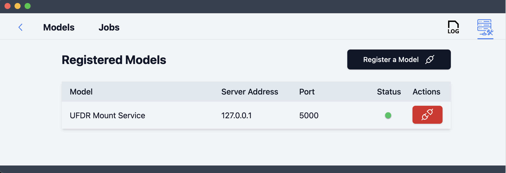
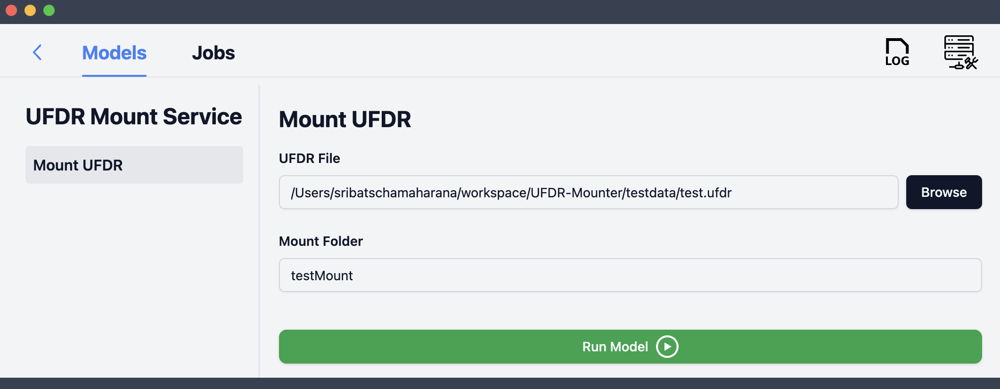

# UFDR-Mounter

A Python-based FUSE virtual filesystem that allows you to mount `.ufdr` and `.zip` archives as read-only directories. This tool lets you browse the contents of forensic archives (like Cellebrite UFDR exports) without extracting them.

Made for integration with RescueBox (UMass Amherst · Spring 2025).


# UFDR

A `.ufdr` file is a Cellebrite forensic export that combines an XML metadata blob and a ZIP archive of file contents. This project allows you to mount The ZIP portion as a virtual file structure.

## Installation and Setup

### 1. Clone the Repository:
```bash
git clone https://github.com/SribatschaMaharana/UFDR-Mounter.git
cd UFDR-Mounter
```

### 2. OS-Specific Notes (before installing dependencies)

#### Windows 

Requires Windows File System Proxy setup - [WinFsp (FUSE-compatible)](https://github.com/winfsp/winfsp/releases)
Download (Release 2.0 is recommended) and run the stable msi installer . 

During install, it is mandatory to select the `Developer` feature in the Custom Setup wizard.

Note: the rescuebox plugin will mount a drive .

#### Linux 
Install FUSE via your package manager:

```bash
sudo apt update && sudo apt install fuse
```
If needed, also allow non-root FUSE mounts (depending on distro):
```bash
sudo usermod -a -G fuse $(whoami)
```

Then log out and log back in to apply group changes.

#### MacOS 

Download macFUSE and give permissions, following the macfuse [wiki](https://github.com/macfuse/macfuse/wiki/Getting-Started)

Grant Full Disk Access: `System Settings → Privacy & Security → Full Disk Access → + Terminal/Python`


## Usage

### Using the Frontend (RescueBox)

1. Open the RescueBox interface.
2. Register the model with the server's IP address (`127.0.0.1`) and port (`5000`).
3. Upload the `.ufdr` file to the **UFDR Mounter Service** interface.
4. Specify the mount point:
   - **Linux/macOS**:  
     Use an absolute path (e.g., `/mnt/test1`)  
     or a short name like `test1` (which will be mounted inside the repo's `mnt/` folder).
   - **Windows**:  
     Enter a valid **drive letter** (e.g., `M:` or `R:`) as the mount point.

Note:  When you exit the RescueBox desktop the path will be un-mounted. Unmount task is not supported in this version.

#### Registering



#### Input format



#### Expected Results


