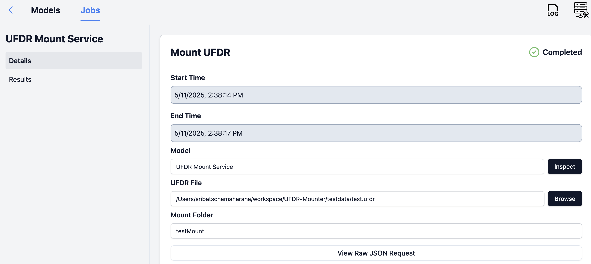

# UFDR-Mounter

A Python-based FUSE virtual filesystem that allows you to mount `.ufdr` and `.zip` archives as read-only directories. This tool lets you browse the contents of forensic archives (like Cellebrite UFDR exports) without extracting them.

Made for integration with RescueBox (UMass Amherst · Spring 2025).


# UFDR

A `.ufdr` file is a Cellebrite forensic export that combines an XML metadata blob and a ZIP archive of file contents. This project allows you to mount The ZIP portion as a virtual file structure.

## Installation ad Setup

### 1. Clone the Repository:
```bash
git clone https://github.com/SribatschaMaharana/UFDR-Mounter.git
cd UFDR-Mounter
```

### 2. OS-Specific Notes (before installing dependencies)

#### MacOS 

Download macFUSE and give permissions, following the macfuse [wiki](https://github.com/macfuse/macfuse/wiki/Getting-Started)

Grant Full Disk Access: `System Settings → Privacy & Security → Full Disk Access → + Terminal/Python`


#### Windows 
Requires Windows File System Proxy setup - [WinFsp (FUSE-compatible)](https://github.com/winfsp/winfsp/releases)
Download and run through the latest stable msi installer

During install, select the `Developer` feature in the Custom Setup wizard.

#### Linux 
Install FUSE via your package manager:

```bash
sudo apt update && sudo apt install fuse
```
If needed, also allow non-root FUSE mounts (depending on distro):
```bash
sudo usermod -a -G fuse $(whoami)
```

Then log out and log back in to apply group changes.


### 3. Set Up a Virtual Environment
Create a new virtual environment using any tool you prefer. 

#### Option 1: Using Conda

If you prefer using **Conda**, create and activate your environment with:

```bash
conda create --name myenv python=3.12
conda activate myenv
```

#### Option 2: Using venv
```bash
python -m venv venv
source venv/bin/activate  # For Mac/Linux
venv\Scripts\activate  # For Windows
```

### 4. Install Dependencies
```bash
pip install -r requirements.txt
```

### 5. Run the mounter service

Run the mount server:
```bash
python ufdr_server.py
```
The server will run on http://127.0.0.1:5000 by default.

## Usage

### Using the Frontend (RescueBox)
- Open the RescueBox interface.
- Register the model with the server's IP address (127.0.0.1) and port (5000).
- Upload the .UFDR file to the UFDR Mounter Service interface as input
- Specify the mount point: 
Linux/MacOS: Use an absolute path (e.g., /mnt/test1) or a short name like test1 (which will be mounted inside the repo's mnt/ folder)
in Windows - Enter a valid drive letter, like M: or R: but not a drive currently in use by your filesystem (like C: or D:)


#### Registering


#### Input format


#### Expected Results




